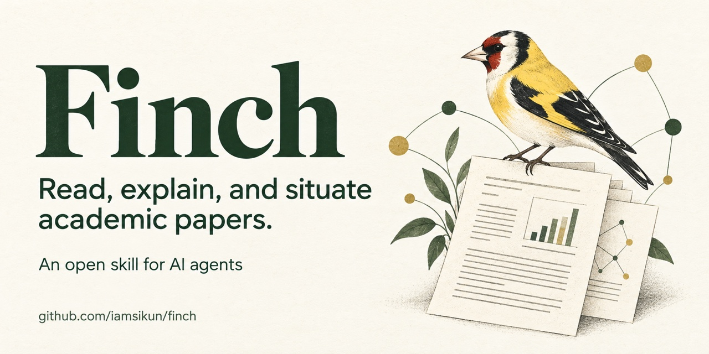

# Finch



**Finch** is a paper-reading skill for LLM agents. It helps you understand an academic paper
well enough to use its ideas:

- **Reconstruct the argument:** what the paper states, assumes, estimates, or proves,
  with locations in the version actually read.
- **Explain the central idea:** what obstacle it overcomes, which ingredient does the
  work, and why that ingredient works.
- **Situate it in the literature:** a small verified neighborhood of foundations,
  predecessors, alternatives, and later work, compared on concrete dimensions.

It covers economics, finance, business, statistics, econometrics, machine learning, and
experimental science. Contribution-type guides load only when relevant.

Finch follows the open [Agent Skills](https://agentskills.io/specification) format, so the
same `skills/finch/` folder works in Claude Code, Codex, Gemini CLI, Cursor, GitHub
Copilot, OpenCode, and other compatible agents.

## Install

Install once and Finch keeps itself current. Releases come from the `stable` branch,
so work in progress never reaches your agents.

**Any agent (recommended):**

```bash
curl -fsSL https://raw.githubusercontent.com/iamsikun/finch/stable/install.sh | bash
```

This one command:
- clones Finch to `~/.local/share/finch`;
- links the skill into every agent it detects (`~/.claude/skills`, the shared
  `~/.agents/skills` read by Codex, Gemini CLI and Cursor, Copilot, OpenCode);
- schedules a daily background update (launchd on macOS, cron on Linux);
- adds a `finch` command (linked into `~/.local/bin`) for status, updates, and uninstalling.

Updates only ever fast-forward to new releases, are skipped quietly when offline, and
never touch a copy you have edited. Restart your agent after installing.

```bash
finch status      # version, links, last update
finch update      # update now
finch uninstall   # remove everything
```

Add `--no-auto-update` to the install command (`... | bash -s -- --no-auto-update`) to
manage updates yourself. If you'd rather read the script before running it, clone the
repo and run `./install.sh`.

**Claude Code: plugin marketplace.** This is the alternative to the installer for
Claude Code users; use one or the other, not both.

```bash
claude plugin marketplace add iamsikun/finch#stable
claude plugin install finch@finch
```

Then turn on auto-update: `/plugin` → **Marketplaces** → **finch** → **Enable
auto-update**. Third-party marketplaces have it off by default. Claude Code then picks up
each new release on its own.

**Other options:**
- **`skills` CLI:** `npx skills add iamsikun/finch -g` installs into the agents it
  detects. Update with the CLI's update command, which `npx skills --help` lists.
- **Manual:** symlink `skills/finch` from a clone into your agent's skills folder, then
  `git pull` to update.

| Agent | User-level path | Project-level path |
|---|---|---|
| Claude Code | `~/.claude/skills/finch` | `.claude/skills/finch` |
| Codex | `~/.agents/skills/finch` | `.agents/skills/finch` |
| Gemini CLI | `~/.gemini/skills/finch` or `~/.agents/skills/finch` | `.gemini/skills/finch` or `.agents/skills/finch` |
| Cursor | `~/.cursor/skills/finch` or `~/.agents/skills/finch` | `.cursor/skills/finch` or `.agents/skills/finch` |

See [CHANGELOG.md](CHANGELOG.md) for what changed in each release.

## Use

Agents should pick up Finch automatically when you ask them to read or explain a paper. You
can also invoke it explicitly: `/finch` in Claude Code, or `$finch` in Codex.

```text
Use finch to read this paper: <PDF path, arXiv link, or DOI>.
```

```text
Use finch to read this paper. Assume I am comfortable with economics, statistics,
and machine learning, but unfamiliar with this specific literature. Explain the
essential idea, why it works, what the evidence establishes, and how it differs from
the closest related papers. Put intuition before technical detail.
```

```text
Use finch for a deep reading of the main theorem. Explain the result precisely,
the role of its assumptions, and the important proof steps. Distinguish what you
checked from what remains unverified.
```

```text
Use finch to quickly triage these five papers. Is each worth a full read for my
project on <topic>?
```

Reading modes: **quick orientation**, **standard** (default), **deep technical**, and
**guided co-reading**. Finch infers the mode from your request.
Focused questions get direct answers; your requested language, length, and format take
precedence over the standard reading brief.

If the host cannot read a local PDF reliably, the skill includes an optional helper:

```bash
python3 skills/finch/scripts/extract_pdf.py paper.pdf paper.txt
```

Run this from a repository clone, or resolve the script inside the installed skill.
It requires Python 3.9+ and Poppler's `pdftotext`, preserves PDF page indices, and records a
source hash. It flags sparse pages for inspection but does not do OCR or validate math.
Ordinary use of Finch requires neither dependency when the agent can already read PDFs.

## Repository layout

```
skills/finch/            the installable skill
  SKILL.md               core workflow (modes, routing, evidence, explanation, checks)
  references/            contribution-type guides, loaded on demand
    empirical.md         causal, structural, experimental, descriptive, qualitative
    formal.md            theory, mathematical statistics, optimization, proofs
    computational.md     empirical ML and algorithms
    literature.md        literature neighborhoods and reading reviews/meta-analyses
  scripts/extract_pdf.py optional local PDF extraction with page anchors
  LICENSE                license included in the portable skill folder
docs/design.md           objectives and the research behind each design choice
docs/sources.md          annotated sources and attribution for adapted ideas
evals/                   evaluation protocol, seed prompts, answer-key template
.claude-plugin/          Claude Code plugin + marketplace manifests
install.sh               installer with automatic updates from the stable branch
CHANGELOG.md             release notes
```

## Status

The development version is 0.2.0 (unreleased); `stable` remains the released channel.
Structural validators, utility regression tests, and a source-checked smoke reading
cover packaging and selected behavior. Whether Finch beats a good ordinary prompt is
still an empirical question. See `evals/README.md` for the comparison protocol and
`docs/sources.md` for the design's sources.

## License

MIT. See [LICENSE](LICENSE). Ideas adapted from other skills are credited in
[docs/sources.md](docs/sources.md).
